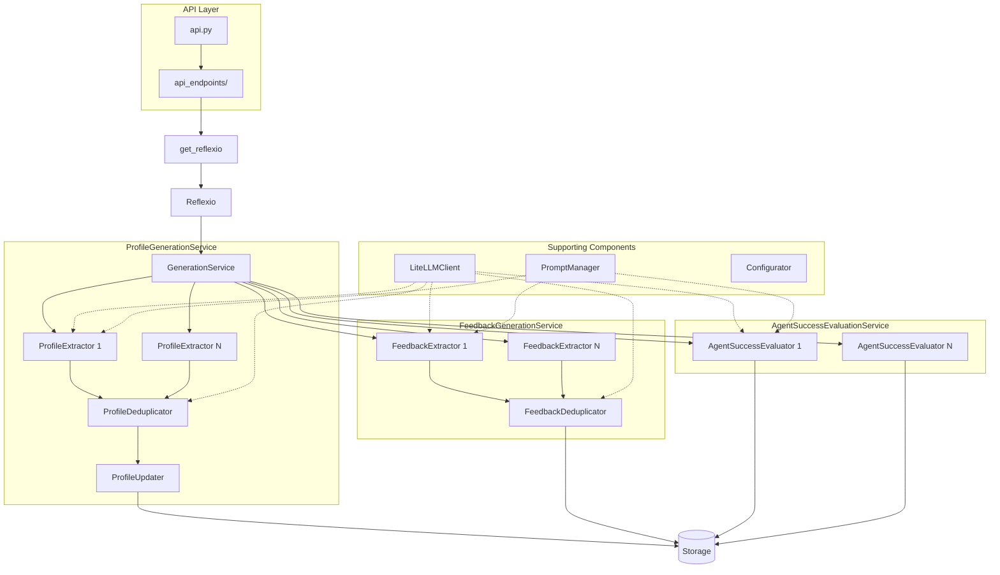

# /user_profiler/reflexio/server
Description: FastAPI backend server that processes user interactions to generate profiles, extract feedback, and evaluate agent success

## Main Entry Points

- **API**: `api.py` - FastAPI routes (only place to expose endpoints)
- **Endpoint Helpers**: `api_endpoints/` - Bridge between routes and business logic
- **Core Service**: `services/generation_service.py` - Main orchestrator

## Cache

**Directory**: `cache/`

| File | Purpose |
|------|---------|
| `reflexio_cache.py` | TTL-cached Reflexio instances (1 hour TTL, max 100 orgs) |

**Key Functions**:
- `get_reflexio(org_id)` - Get or create cached instance
- `invalidate_reflexio_cache(org_id)` - Invalidate after config changes
- `clear_reflexio_cache()` - Clear entire cache (testing/admin)

**Pattern**: **ALWAYS use `get_reflexio()`** instead of `Reflexio()` directly in API endpoints

## API Endpoints

**Directory**: `api_endpoints/`

| File | Purpose |
|------|---------|
| `request_context.py` | RequestContext (bundles org_id, storage, configurator, prompt_manager) |
| `publisher_api.py` | Publishing user interactions |
| `retriever_api.py` | Retrieving profiles, interactions, requests |
| `login.py` | Authentication with TTL-cached org lookups (5 min TTL), email verification, password reset |
| `precondition_checks.py` | Request validation |

**Key Endpoints**:
- `POST /api/publish_interaction` - Publish interactions (triggers profile/feedback/evaluation)
- `POST /api/get_requests` - Get request groups with associated interactions
- `GET /api/get_all_interactions` - Get all interactions across all users
- `GET /api/get_profile_statistics` - Profile statistics by status
- `GET /api/get_all_profiles?status_filter=<status>` - Filter by status (current/pending/archived)
- `POST /api/rerun_profile_generation` - Regenerate profiles from ALL interactions (creates PENDING)
- `POST /api/manual_profile_generation` - Regenerate profiles from window-sized interactions (creates CURRENT)
- `POST /api/upgrade_all_profiles` - PENDING → CURRENT, delete old ARCHIVED
- `POST /api/downgrade_all_profiles` - ARCHIVED → CURRENT, demote PENDING
- `POST /api/add_raw_feedback` - Add raw feedback directly to storage
- `POST /api/rerun_feedback_generation` - Regenerate feedback for agent version (creates PENDING)
- `POST /api/manual_feedback_generation` - Regenerate feedback from window-sized interactions (creates CURRENT)
- `POST /api/run_feedback_aggregation` - Aggregate raw feedbacks into insights
- `POST /api/upgrade_all_raw_feedbacks` - PENDING → CURRENT for raw feedbacks
- `POST /api/downgrade_all_raw_feedbacks` - ARCHIVED → CURRENT for raw feedbacks
- `DELETE /api/delete_feedback` - Delete feedback by ID
- `DELETE /api/delete_raw_feedback` - Delete raw feedback by ID
- `GET /api/get_operation_status` - Get background operation status

**Authentication Endpoints**:
- `POST /api/verify-email` - Verify email with token
- `POST /api/resend-verification` - Resend verification email
- `POST /api/forgot-password` - Request password reset email
- `POST /api/reset-password` - Reset password with token

**Self-Host Mode** (`SELF_HOST=true`): No auth, default org: `self-host-org`, requires S3 config storage (`CONFIG_S3_*` env vars)

**Pattern**: All endpoints call `Reflexio` from `reflexio_lib.py`

## Database

**Directory**: `db/`

Key files:
- `database.py`: Connection setup (priority: S3 in self-host → Supabase → SQLite)
- `db_models.py`: SQLAlchemy models (users, tokens, configs)
- `db_operations.py`: CRUD operations with retry logic (tenacity: 3 attempts, exponential backoff)
- `login_supabase_client.py`: Cloud Supabase client for auth (see `supabase_login/README.md`)
- `s3_org_storage.py`: S3-based organization storage for self-host mode (singleton, cached in memory)

**Connection Priority** (in `database.py` and `db_operations.py`):
1. **S3** - Self-host mode with `CONFIG_S3_*` env vars → Uses `S3OrganizationStorage`
2. **Supabase** - `LOGIN_SUPABASE_URL` + `LOGIN_SUPABASE_KEY` → Uses Supabase client
3. **SQLite** - Fallback for local development

**Self-Host Mode** (`SELF_HOST=true`): Requires S3 configuration
- All org/auth data stored in S3 via `S3OrganizationStorage`
- S3 file: `auth/organizations.json` (with optional Fernet encryption)
- No local database needed

**Note**: Only for auth/config, NOT for profiles/interactions (those use Storage)

## LLM Client

**Directory**: `llm/`
**Entry Point**: `litellm_client.py` - `LiteLLMClient`

Key files:
- `litellm_client.py`: Unified LiteLLMClient using LiteLLM for multi-provider support
- `openai_client.py`: OpenAI implementation (legacy, do not use directly)
- `claude_client.py`: Claude implementation (legacy, do not use directly)
- `llm_utils.py`: Helper functions for Pydantic model conversion

**Features**:
- Uses LiteLLM for multi-provider support (OpenAI, Claude, Azure, etc.)
- API keys read from environment variables (OPENAI_API_KEY, ANTHROPIC_API_KEY)
- Interface: `generate_response()`, `generate_chat_response()`, `get_embedding()`
- **Structured Outputs**: Supports Pydantic models via `response_format` parameter
- Return types: `str` for text, or `BaseModel` for Pydantic models

**Usage**:
```python
from reflexio.server.llm.litellm_client import LiteLLMClient, LiteLLMConfig

# Create client
config = LiteLLMConfig(model="gpt-4o-mini")
client = LiteLLMClient(config)

# Text response
response = client.generate_response("Hello")  # Returns str

# Structured output with Pydantic model
from pydantic import BaseModel
class Answer(BaseModel):
    result: int
response = client.generate_response("What is 2+2?", response_format=Answer)  # Returns Answer instance
```

**Rules**:
- **ALWAYS use `LiteLLMClient`**, never import `OpenAIClient` or `ClaudeClient` directly
- **ALWAYS use Pydantic models** for structured outputs (dict-based schemas are not supported)

## Prompts

**Directory**: `prompt/`

Key components:
- `prompt_manager.py`: PromptManager for loading and rendering
- `prompt_bank/`: Templates by prompt_id (metadata.json + version.prompt files)

**Pattern**: Access via `request_context.prompt_manager.render_prompt(prompt_id, variables)`

## Site Variables

**Directory**: `site_var/`
**File**: `site_var_manager.py` - SiteVarManager (singleton)

Global settings: model names, embedding models, feature flags
Access: `SiteVarManager().get_site_var(key)`

## Email Service

**Directory**: `services/email/`

| File | Purpose |
|------|---------|
| `email_service.py` | EmailService - sends emails via AWS SES |
| `templates/` | Email templates (verification, password reset) |

**Features**:
- Email verification for new registrations
- Password reset emails
- Uses AWS SES (requires `AWS_REGION`, `SES_SENDER_EMAIL` env vars)

**Usage**: `get_email_service()` from `api.py` (lazy-loaded singleton)

## Services

**Directory**: `services/`

### Orchestrator

**File**: `generation_service.py` - GenerationService

Main orchestrator flow:
1. Save interactions to storage
2. Run ProfileGenerationService (each extractor handles its own stride/data collection)
3. Run FeedbackGenerationService (each extractor handles its own stride/data collection)
4. Run AgentSuccessEvaluationService (each extractor handles its own stride/data collection)

**Stride Processing**: Each extractor independently checks if it should run based on its configured stride size and tracks its own operation state.

Called by API endpoints via `Reflexio`

### Base Infrastructure

- `base_generation_service.py`: Abstract base for all services (parallel extractor execution via ThreadPoolExecutor)
- `extractor_config_utils.py`: Shared utility for filtering extractor configs by source, `allow_manual_trigger`, and extractor names
- `extractor_interaction_utils.py`: Per-extractor utilities for stride checking, operation state management, and source filtering
- `deduplication_utils.py`: Base deduplicator class for LLM-based semantic matching (used by ProfileDeduplicator and FeedbackDeduplicator)
- `service_utils.py`: Utilities (`construct_messages_from_interactions()`, `format_interactions_to_history_string()`, `extract_json_from_string()`)

**In-Progress Lock Management**:
- Prevents duplicate generation when back-to-back requests arrive
- Uses **atomic lock acquisition** via `try_acquire_in_progress_lock()` (Supabase RPC function)
- Stale lock timeout: 5 minutes (assumes crashed if lock held longer)
- Lock scoping:
  - **Profile generation**: Per-user (`profile_generation_in_progress::{org_id}::{user_id}`)
  - **Feedback generation**: Per-org (`feedback_generation_in_progress::{org_id}`)
- Re-run mechanism: If new request arrives during generation, `pending_request_id` is set and generation re-runs after completion

### Profile Generation

**Directory**: `services/profile/`

Key files:
- `profile_generation_service.py`: Service orchestrator
- `profile_extractor.py`: Extractor that generates profile updates
- `profile_updater.py`: Applies updates (add/delete/mention) to storage
- `profile_deduplicator.py`: Merges duplicate profiles from multiple extractors using LLM

**Flow**: Interactions → ProfileExtractor → ProfileDeduplicator (optional) → ProfileUpdater → Storage

**Generation Modes**:
| Mode | Trigger | Interactions | Output Status | Use Case |
|------|---------|--------------|---------------|----------|
| Regular | Auto (on publish) | Window-sized | CURRENT | Normal operation |
| Rerun | Manual | ALL | PENDING | Test prompt changes |
| Manual Regular | Manual | Window-sized | CURRENT | Force regeneration |

**Constructor Flags** (`ProfileGenerationService`):
- `allow_manual_trigger`: Include `manual_trigger=True` extractors (default: False)
- `output_pending_status`: Set output profiles to PENDING status (default: False)

**Profile Versioning Workflow**:

Users can regenerate and manage profile versions using a four-state system:

1. **CURRENT** (status=None): Active profiles shown to users
2. **PENDING** (status="pending"): Newly generated profiles awaiting review
3. **ARCHIVED** (status="archived"): Previous version of profiles
4. **ARCHIVE_IN_PROGRESS** (status="archive_in_progress"): Temporary status during downgrade operation

**Rerun Workflow**:
```
1. Rerun Generation → Creates PENDING profiles (existing CURRENT unchanged)
2. Review PENDING → Compare new vs current profiles
3. Upgrade → CURRENT→ARCHIVED, PENDING→CURRENT, delete old ARCHIVED
4. OR Downgrade → CURRENT→ARCHIVED (restore previous version), ARCHIVED→CURRENT (swap)
```

**Upgrade Process** (3 atomic steps):
1. Archive all CURRENT profiles → ARCHIVED
2. Promote all PENDING profiles → CURRENT
3. Delete all old ARCHIVED profiles

**Downgrade Process** (3 atomic steps):
1. Mark all CURRENT profiles → ARCHIVE_IN_PROGRESS (temporary)
2. Restore all ARCHIVED profiles → CURRENT
3. Complete archiving: ARCHIVE_IN_PROGRESS → ARCHIVED

**Use Cases**:
- Test prompt changes without affecting production profiles
- Review AI-generated updates before deployment
- Rollback to previous profile version if needed

### Feedback Extraction

**Directory**: `services/feedback/`

Key files:
- `feedback_generation_service.py`: Service orchestrator
- `feedback_extractor.py`: Extractor that extracts raw feedback
- `feedback_aggregator.py`: Aggregates similar raw feedbacks
- `feedback_deduplicator.py`: Merges duplicate feedbacks from multiple extractors using LLM

**Flow**:
- Interactions → FeedbackExtractor → FeedbackDeduplicator (optional) → RawFeedback → Storage
- RawFeedback (manual trigger) → FeedbackAggregator → Feedback → Storage

**Rerun Behavior**: Groups interactions by `user_id` for per-user feedback extraction (fetches all users, then processes each user's interactions together)

**Generation Modes**:
| Mode | Trigger | Interactions | Output Status | Use Case |
|------|---------|--------------|---------------|----------|
| Regular | Auto (on publish) | Window-sized | CURRENT | Normal operation |
| Rerun | Manual | ALL | PENDING | Test prompt changes |
| Manual Regular | Manual | Window-sized | CURRENT | Force regeneration |

**Constructor Flags** (`FeedbackGenerationService`):
- `allow_manual_trigger`: Include `manual_trigger=True` extractors (default: False)
- `output_pending_status`: Set output raw feedbacks to PENDING status (default: False)

**Raw Feedback Versioning Workflow**:

Similar to profiles, raw feedbacks support versioning:

1. **CURRENT** (status=None): Active raw feedbacks
2. **PENDING** (status="pending"): Newly generated raw feedbacks awaiting review
3. **ARCHIVED** (status="archived"): Previous version of raw feedbacks

**Rerun Workflow**:
```
1. Rerun Feedback Generation → Creates PENDING raw feedbacks
2. Review PENDING → Compare new vs current
3. Upgrade → CURRENT→ARCHIVED, PENDING→CURRENT, delete old ARCHIVED
4. OR Downgrade → Swap ARCHIVED↔CURRENT
```

### Agent Success Evaluation

**Directory**: `services/agent_success_evaluation/`

Key files:
- `agent_success_evaluation_service.py`: Service orchestrator
- `agent_success_evaluator.py`: Evaluates success and improvement areas
- `agent_success_evaluation_constants.py`: Output schemas (`AgentSuccessEvaluationOutput`, `AgentSuccessEvaluationWithComparisonOutput`)
- `agent_success_evaluation_utils.py`: Message construction utilities

**Flow**: Interactions → AgentSuccessEvaluator → AgentSuccessEvaluationResult → Storage

**Shadow Comparison Mode**: When interactions contain `shadow_content`, evaluator automatically:
1. Randomly assigns regular/shadow to Request 1/2 (avoids position bias)
2. Evaluates regular version for success
3. Compares regular vs shadow to determine which is better
4. Returns `regular_vs_shadow` field with values: `REGULAR_IS_BETTER`, `REGULAR_IS_SLIGHTLY_BETTER`, `SHADOW_IS_BETTER`, `SHADOW_IS_SLIGHTLY_BETTER`, `TIED`

### Storage

**Directory**: `services/storage/`

| File | Purpose |
|------|---------|
| `storage_base.py` | BaseStorage abstract class |
| `supabase_storage.py` | Production storage with vector embeddings |
| `local_json_storage.py` | Local file-based for testing |

**Pattern**: **NEVER import SupabaseStorage/LocalJsonStorage directly** - Always use `request_context.storage`

**Key Methods**:
- CRUD: profiles, interactions, feedbacks, results, requests
- `get_request_groups()` → `dict[str, list[RequestInteractionDataModel]]` (groups by request_id)
- `get_feedbacks(status_filter, feedback_status_filter)` - Filter by profile status and approval status
- Vector search via LiteLLMClient embeddings
- Operation state: `get_operation_state_with_new_interactions()` for stride-based processing
- **Atomic lock**: `try_acquire_in_progress_lock()` - Atomic lock acquisition for concurrent request handling
- Profile status: `Status` enum (CURRENT=None, PENDING, ARCHIVED)

### Configurator

**Directory**: `services/configurator/`

Key files:
- `configurator.py`: SimpleConfigurator - loads YAML config, creates storage
- `local_json_config_storage.py`: Local file-based config storage
- `rds_config_storage.py`: RDS database config storage (default for cloud)
- `s3_config_storage.py`: S3-based config storage with optional encryption

**Config Storage Priority** (in `SimpleConfigurator`):
1. **Local** - If `base_dir` is explicitly provided (testing)
2. **S3** - If all `CONFIG_S3_*` env vars are set (required in self-host mode)
3. **RDS** - Default fallback (not available in self-host mode)

**Path Handling**: LocalJsonConfigStorage automatically converts relative paths to absolute using `os.path.abspath()`

Access: `request_context.configurator`

## Architecture Patterns

### Request Flow
```
API Request (api.py)
  -> API Endpoint (api_endpoints/)
    -> get_reflexio() (cache/)
      -> Reflexio (reflexio_lib.py)
        -> GenerationService
          ├─> ProfileGenerationService → Storage
          ├─> FeedbackGenerationService → Storage
          └─> AgentSuccessEvaluationService → Storage
```



### Service Pattern

All services follow BaseGenerationService:
1. Load extractor configs from YAML
2. Load generation service config from request (runtime parameters)
3. Filter extractors by source, `allow_manual_trigger`, and extractor names (via `extractor_config_utils`)
4. Create extractors with both configs
5. Run extractors in parallel (ThreadPoolExecutor)
6. Process and save results to storage

**Extractor Pattern**: Multiple extractors run in parallel, each handling its own data collection. Each extractor:
- Receives **ExtractorConfig** (from YAML): Static configuration like prompts and settings
- Receives **GenerationServiceConfig** (from request): Runtime parameters like user_id, source
- **Collects its own interactions** using `extractor_interaction_utils.py`:
  - Gets per-extractor window/stride parameters (override or global fallback)
  - Applies source filtering based on `request_sources_enabled`
  - Checks stride threshold before running
  - Updates per-extractor operation state after processing

**Per-Extractor Window Overrides**: Each extractor config can override global window settings:
- `extraction_window_size_override`: Override global `extraction_window_size` for this extractor
- `extraction_window_stride_override`: Override global `extraction_window_stride` for this extractor
- Each extractor applies its own override or falls back to global values

### Key Rules

**Reflexio Instances**:
- **NEVER instantiate `Reflexio()` directly** in API endpoints
- **ALWAYS use**: `get_reflexio(org_id)` from `cache/reflexio_cache.py`
- Cache invalidated automatically on config changes

**Storage**:
- **NEVER import SupabaseStorage/LocalJsonStorage directly**
- **ALWAYS use**: `request_context.storage` (type: BaseStorage)

**LLM**:
- **NEVER import OpenAIClient/ClaudeClient directly**
- **ALWAYS use**: `LiteLLMClient` (uses LiteLLM for multi-provider support)

**Prompts**:
- **NEVER hardcode prompts**
- **ALWAYS use**: `request_context.prompt_manager.render_prompt(prompt_id, variables)`
- Prompts versioned in `prompt_bank/`
